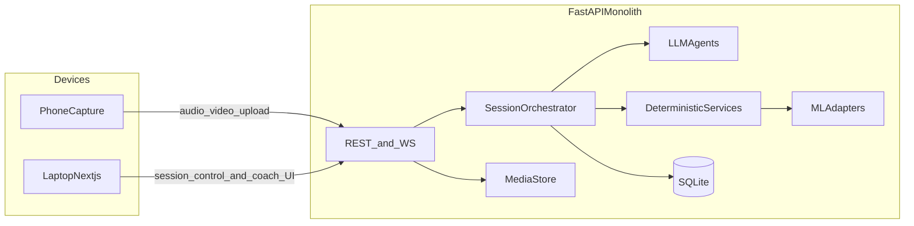
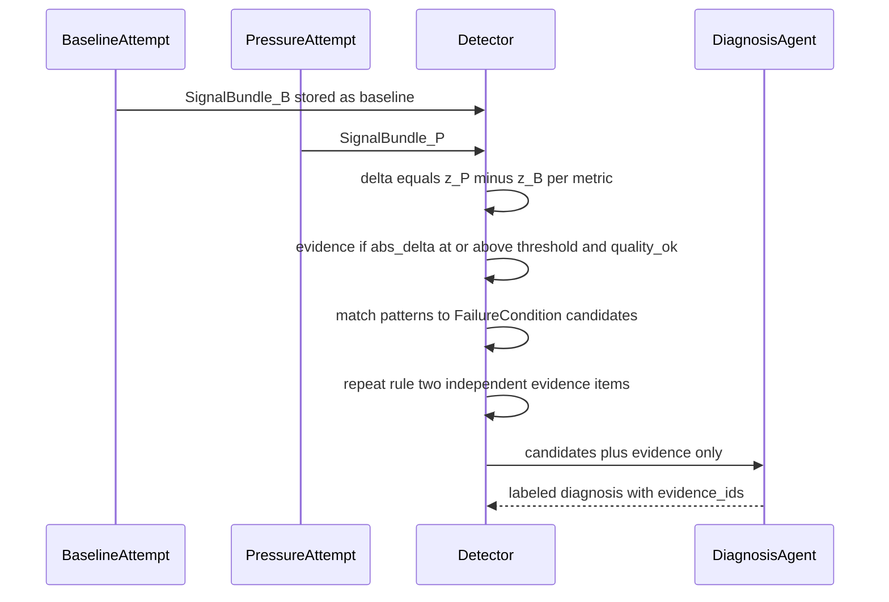

# Pitchground architecture

Planning document for the hackathon **P0** backend: a multilingual adaptive interview loop. This repository is **backend + ML integration only**. The frontend is a separate Next.js app owned by another teammate.

**Do not treat this file as license to add Kafka, Redis, Celery, a vector database, multiple LLM vendors, or one process per agent.**

Related docs: [PRD_RECONCILIATION.md](PRD_RECONCILIATION.md) · [API.md](API.md) · [ML_CONTRACTS.md](ML_CONTRACTS.md) · [DEMO.md](DEMO.md)

---

## Frozen decisions (before any application code)

These are closed. Change them only with an explicit team decision.


| #   | Decision          | Frozen value                                                                                             | Justification                                                                                                  |
| --- | ----------------- | -------------------------------------------------------------------------------------------------------- | -------------------------------------------------------------------------------------------------------------- |
| 1   | Database          | **SQLite** via SQLAlchemy + Alembic                                                                      | Persist learner state without ops. Postgres is P1.                                                             |
| 2   | Speech-to-text    | **Whisper via OpenAI-compatible HTTP API**; local Whisper only if the API is unavailable                 | Transcription is required; GPU setup is not.                                                                   |
| 3   | LLM               | **Single OpenAI-compatible provider** (`OPENAI_BASE_URL`, `OPENAI_API_KEY`, default model `gpt-4o-mini`) | Interviewer copy, diagnosis prose, challenge copy. One vendor. Groq/OpenAI/compatible hosts swap via base URL. |
| 4   | Phone role        | **Paired capture accessory**; laptop is the interview + coach UI                                         | Phone does not run models or choose the next question. Laptop webcam is a valid fallback.                      |
| 5   | P0 languages      | `en` **primary,** `hi` **secondary** (code-switch metrics between them)                                  | One multilingual pair; not a full language matrix.                                                             |
| 6   | Enums             | SkillDimension / FailureCondition / TrainingObjective in [PRD_RECONCILIATION.md](PRD_RECONCILIATION.md)  | Working names until PDF labels are confirmed.                                                                  |
| 7   | P0 pressure knobs | `time_limit` **and** `interruption` **only**                                                             | Controlled, comparable pressure. Audience / language-shift are P1.                                             |
| 8   | Analysis timing   | **Analyze after each take**, not frame-streaming                                                         | Reliability and simple data flow.                                                                              |
| 9   | Video             | **Optional**. Missing video → visual scores `null`; fusion still runs                                    | Audio is required for P0.                                                                                      |
| 10  | Questions         | **Question bank + LLM rewrite**                                                                          | Demo-stable prompts; InterviewerAgent does not invent the topic.                                               |
| 11  | Phase lockstep    | **Frontend calls** `POST .../advance` after displaying a step                                            | Prevents FE/BE phase drift. Backend does not auto-jump the UI.                                                 |
| 12  | Media             | **Local filesystem** under `data/media/`; wipe between demos                                             | No object store in P0.                                                                                         |
| 13  | Jobs              | **FastAPI BackgroundTasks / in-process async**                                                           | No Celery; analysis is per-utterance.                                                                          |
| 14  | Auth              | **Optional shared demo token** (`DEMO_TOKEN`). No user accounts                                          | P0 is a staged loop, not a product login.                                                                      |
| 15  | Process shape     | **One FastAPI process**                                                                                  | Orchestrator, services, adapters, agents in one app.                                                           |


---


## 1. System architecture




### Boundaries


| Layer            | Owner          | Does                                                                      | Does not                                       |
| ---------------- | -------------- | ------------------------------------------------------------------------- | ---------------------------------------------- |
| Next.js frontend | Other teammate | Pairing, question UI, record controls, evidence/diagnosis/compare views   | Scoring, diagnosis rules, next-question policy |
| FastAPI backend  | This repo      | Session lifecycle, persistence, training spec, agent calls, ML invocation | Pixel UI                                       |
| ML adapters      | Joint          | Fill `SignalBundle` from media + transcript                               | Write DB, advance session, call LLM            |
| LLM agents       | This repo      | Render question/diagnosis/challenge text                                  | Own scores or session phase                    |
| SQLite + files   | This repo      | Learners, attempts, evidence, media bytes                                 | Event streaming                                |


### Phone vs laptop

- **Laptop:** primary surface — question, timer, interviewer copy, coach/evidence panel, retry comparison. May capture mic/camera if no phone.
- **Phone:** pairs with `session_id`, uploads a completed take (audio required, video optional). Subscribe to WebSocket for status only.


### Data flow (one utterance)

Capture → persist media → transcribe → extract signals → score vs baseline → persist attempt → wait for `advance` → orchestrator next phase (`apply_pressure` | `diagnose` | `challenge` | `replay` | `compare` | `end`) → WebSocket event → persist learner state when the step completes.

---


## 2. Backend architecture

One FastAPI application (future tree; not scaffolded in this planning commit):

```
app/
  api/rest  api/ws
  orchestration/   # state machine + training engine
  agents/          # interviewer, diagnosis, challenge
  services/        # baseline, signals, detector, comparison, learner_state
  ml/              # protocols + adapters
  models/ repositories/ schemas/
  storage/media.py
```


### Synchronous vs asynchronous

- **Sync request/response:** create learner/session, get profile, get attempt, pair device, `advance`.
- **Upload ACK sync:** media write returns immediately; analysis is not in that request body wait if it would exceed a few seconds — `complete` enqueues BackgroundTasks and returns `202` with `analysis_status`.
- **In-process async:** Whisper + signals + scoring + optional LLM.
- **WebSocket:** one channel per `session_id`. Events: `question`, `pressure_applied`, `recording_started`, `recording_stopped`, `analysis_progress`, `attempt_scored`, `diagnosis_ready`, `challenge_ready`, `compare_ready`, `phase_changed`, `error`.


### Session lifecycle

Illegal transitions are rejected by the orchestrator (HTTP 409), never by an LLM.

`created` → `baseline_prompt` → `baseline_recording` → `baseline_analyzed` → `pressure_prompt` → `pressure_recording` → `pressure_analyzed` → `diagnosing` → `challenge_prompt` → `replay_condition` → `retry_recording` → `comparing` → `profile_updated` → `completed`

---


## 3. Agent and service architecture

**Rule:** Most of the P0 loop is not an LLM. Orchestrator calls functions in order. No agent-to-agent bus. No microservice per agent.

### SessionOrchestrator — deterministic

- **Responsibility:** Drive the 13-step loop; only component allowed to change `sessions.phase`.
- **Inputs:** `SessionState`, last `AttemptResult`, `LearnerProfile`.
- **Outputs:** `NextAction` `{type, question_spec, pressure_spec, ui_hints}`.
- **Tools:** repositories, ML runners, agent clients.
- **Reads/writes:** session, attempts, current action payload.
- **LLM?** No.


### InterviewerAgent — LLM

- **Responsibility:** Render question / follow-up / interruption line in target language and audience voice from a **bank item + TrainingSpec**. Does not choose pressure or difficulty.
- **Inputs:** `TrainingSpec`, bank item, last transcript (optional), language.
- **Outputs:** `{prompt_text, language, expected_duration_sec, interruption_script?}`.
- **Tools:** none (optional `get_question_bank_item(id)` is a local lookup, not an LLM tool).
- **State:** reads spec; writes nothing (orchestrator stores the prompt).
- **LLM?** Yes — multilingual scenario wording.


### SignalExtractionService — deterministic + ML

- **Responsibility:** Build typed `SignalBundle`.
- **Inputs:** audio path, optional video path, transcript, language hint.
- **Outputs:** acoustic, linguistic, visual, content, fused scores.
- **Tools:** ML adapters only.
- **Writes:** `attempt_metrics`.
- **LLM?** No.


### BaselineService — deterministic

- **Responsibility:** Freeze per-learner, per-session baseline from the low-pressure attempt.
- **Inputs:** baseline `SignalBundle`.
- **Outputs:** `BaselineVector`.
- **Writes:** `baselines`.
- **LLM?** No.


### FailureDetectorService — deterministic

- **Responsibility:** Deltas, evidence, candidate failure scores, repeat-evidence rule.
- **Inputs:** baseline and pressure (later retry) bundles.
- **Outputs:** `CandidateFailure[]` with evidence IDs.
- **Writes:** `evidence`, `failure_candidates`.
- **LLM?** No — measurable and explainable.


### DiagnosisAgent — LLM, constrained

- **Responsibility:** Human-readable diagnosis **only from** provided candidates + evidence. May rank/explain. **Must not invent a FailureCondition.**
- **Inputs:** candidates, evidence, transcripts, metric table.
- **Outputs:** `{primary_failure_condition, confidence, rationale, evidence_ids}`.
- **Tools:** none.
- **Writes:** none (orchestrator persists `diagnoses`).
- **Guard:** if LLM returns an unknown condition, discard prose and use top detector candidate; LLM may **lower** confidence, never raise it.


### ChallengeAgent — LLM, constrained

- **Responsibility:** Student-facing challenge text that recreates a **comparable** condition (same pressure knobs, same or isomorphic prompt).
- **Inputs:** diagnosis, `LearnerProfile`, allowed knobs, language.
- **Outputs:** copy + proposed `TrainingSpec`.
- **Guard:** training engine **rejects** unknown knobs or missing replay comparability; engine wins.


### ComparisonService — deterministic

- **Responsibility:** Compare pressure vs retry on diagnosed metrics: `improved | unchanged | worsened`.
- **Optional LLM:** one-paragraph coach summary; scores stay deterministic.


### LearnerStateService — deterministic

- **Responsibility:** Communication-graph update after every attempt; append profile snapshot.

---


## 4. ML architecture

See [ML_CONTRACTS.md](ML_CONTRACTS.md) for typed I/O.

- Speech: resample → Whisper API → transcript + acoustic features (WPM, pause ratio, fillers, pitch/energy var).
- Transcript: counts and rules (sentence length, repetition, discourse markers).
- Language: segment language ID → `primary_language_ratio`, `code_switch_rate`.
- Content: keyword/checklist overlap vs bank item key points (no second model provider).
- Vision: MediaPipe on ~5 fps if video exists; else `null`.
- Fusion: weighted z-scores **vs this learner’s baseline**, config weights, not a trained net.
- Breakdown model: rule table, not a neural net.

**Inference boundary:** ML never writes the DB, never advances phase, never calls the LLM.

---


## 5. Failure detection




1. **Baseline** — no timer, no interruption; store raw + fused metrics.
2. **Pressure** — apply `time_limit` and/or `interruption`.
3. **Delta** — learner-specific, not population norms.
4. **Evidence** — `{metric, baseline, observed, delta, threshold, modality, span, excerpt?}`.
5. **Candidates** — rule table (see reconciliation file).
6. **Repeat rule** — `low`: one metric; `medium`: two modalities or two spans on the same take (P0 demo uses this); `high`: pattern on two attempts.
7. **Confidence** — detector score × evidence-count factor; LLM cannot raise it. UI shows evidence chips, not only prose.

---


## 6. Adaptive training engine

Pure function: `TrainingSpec = select(LearnerProfile, Diagnosis, SessionPolicy)`.


| Knob                | Rule                                                                                                                    |
| ------------------- | ----------------------------------------------------------------------------------------------------------------------- |
| training objective  | Map primary `FailureCondition` → `TrainingObjective`                                                                    |
| pressure level      | 0 baseline, 1 one knob, 2 both knobs; raise only if last retry improved; lower if worsened                              |
| question difficulty | Weak `content_adequacy` → easier bank item, same pressure; weak delivery → same item difficulty, more delivery pressure |
| language            | Keep `practice_language`; if `language_instability`, keep the same pair on replay                                       |
| audience            | P0 fixed `peer`; not randomized after diagnosis                                                                         |
| time limit          | On for `freeze`, `ramble`, `knowledge_gap`; seconds from policy table                                                   |
| interruption        | On for `fluency_breakdown`, `delivery_collapse`, `ramble`                                                               |
| replay condition    | `same_prompt` (default for demo) or `isomorphic_prompt`; **same knobs**                                                 |


ChallengeAgent fills text; engine validates enums.

---


## 7. Learner state / communication graph

Relational graph (not Neo4j).

**Nodes:** Learner, SkillDimension, FailureCondition, TrainingObjective, Attempt, Evidence.

**Edges:**

- Learner —strength→ SkillDimension (`score`, `n`, `updated_at`)
- Attempt —exhibits→ FailureCondition (`confidence`)
- FailureCondition —trained_by→ TrainingObjective
- Attempt —compared_to→ Attempt (`improved`)
- Evidence —supports→ FailureCondition

**History:** append-only `profile_snapshots`.

**After every attempt:** write metrics → EMA on fused dimensions → increment failure counts if diagnosed → comparison edge if present → snapshot.

---


## 8. Database design

SQLite file: `data/pitchground.db`.

### Tables (important fields)

- `learners` — `id`, `display_name`, `practice_language`, `created_at`
- `sessions` — `id`, `learner_id`, `phase`, `policy_json`, `current_action_json`, `created_at`, `completed_at`
- `session_events` — `id`, `session_id`, `type`, `payload_json`, `created_at`
- `attempts` — `id`, `session_id`, `learner_id`, `role`, `media_audio_path`, `media_video_path`, `prompt_id`, `pressure_spec_json`, `created_at`
- `transcripts` — `attempt_id` PK, `text`, `language`, `segments_json`
- `attempt_metrics` — `attempt_id` PK, `signal_bundle_json`, `fused_json`
- `baselines` — `session_id` PK, `vector_json`
- `evidence` — `id`, `attempt_id`, `metric`, `delta`, `threshold`, `modality`, `excerpt`, `payload_json`
- `failure_candidates` — `id`, `attempt_id`, `condition`, `score`
- `diagnoses` — `id`, `session_id`, `attempt_id`, `condition`, `confidence`, `rationale`, `evidence_ids_json`
- `challenges` — `id`, `session_id`, `diagnosis_id`, `training_spec_json`, `prompt_text`
- `comparisons` — `id`, `session_id`, `attempt_a`, `attempt_b`, `report_json`, `improved`
- `learner_dimension_scores` — `learner_id`, `dimension`, `score`, `n`, `updated_at`
- `profile_snapshots` — `id`, `learner_id`, `session_id`, `snapshot_json`, `created_at`
- `device_pairs` — `session_id`, `device_role` (`phone`|`laptop`), `token`, `last_seen`
- `question_bank` — `id`, `topic`, `difficulty`, `language`, `prompt`, `key_points_json`, `isomorphic_group`


### Indexes

`sessions(learner_id)`, `attempts(session_id)`, `attempts(learner_id, created_at)`, `evidence(attempt_id)`, `diagnoses(session_id)`, `profile_snapshots(learner_id, created_at DESC)`, `device_pairs(token)`.

### Persist vs derive

**Persist:** media paths, transcripts, raw+fused metrics, baselines, evidence, diagnoses, training specs, snapshots, phase.  
**Derive at read time:** z-scores (also persist inside evidence for demo stability), UI traffic lights, next pressure level (also stored on `TrainingSpec` once chosen).

---


## 9–12. API, events, repo, contracts

- HTTP/WS: [API.md](API.md)  
- Full session trace: [DEMO.md](DEMO.md) and section 10 below  
- Future application tree: section 11 below  
- Typed interfaces: [ML_CONTRACTS.md](ML_CONTRACTS.md) and [API.md](API.md)


### 10. Full session trace

1. `POST /v1/learners` then `POST /v1/sessions`
2. Laptop opens `GET /v1/sessions/{id}/ws`; phone `POST .../pair-device`
3. Orchestrator → InterviewerAgent (baseline bank item) → WS `question`; FE `advance` into `baseline_recording`
4. Record → `POST .../media` → `POST .../complete` → analysis job
5. BaselineService freeze; WS `attempt_scored`; FE `advance`
6. Pressure spec (`time_limit` + `interruption`); InterviewerAgent; WS `pressure_applied` + `question`
7. Second take and analysis
8. Detector + DiagnosisAgent; WS `diagnosis_ready`
9. Engine + ChallengeAgent; WS `challenge_ready`
10. Replay same knobs + `same_prompt`
11. Retry take; ComparisonService; WS `compare_ready`
12. FE shows improvement on diagnosed metrics
13. LearnerStateService snapshot; phase `completed`


### 11. Future repository structure (implementation phase)

```
/
  README.md
  docs/
  pyproject.toml
  app/
    main.py
    config.py
    api/rest/  api/ws/
    orchestration/
    agents/
    services/
    ml/
    models/  repositories/  schemas/
    storage/media.py
  tests/
```

This planning commit contains **docs and README only**.

---


## 13. MVP scope

**P0 — must build:** the 13-step loop; audio required; video best-effort; `en`/`hi`; one FastAPI process; Next.js consumes APIs.

**P1:** live partial transcripts; second camera; richer vision; isomorphic bank; coach LLM summary; auth; Postgres.

**P2 — do not build:** Kafka, Redis, Celery, vector DB, multi-LLM routing, per-agent services, trained breakdown net, full language matrix, SSO, native mobile app, marketplace, curriculum OS.

---


## 14. Implementation order

1. Schemas + SQLite + state machine with stub ML/agents
2. REST + WS + media upload (frontend can drive a fake loop)
3. Whisper API
4. Acoustic + transcript metrics; baseline + detector
5. Fusion + failure rules + evidence
6. InterviewerAgent
7. DiagnosisAgent + ChallengeAgent + engine validation
8. Vision adapter (optional path)
9. Comparison + snapshots
10. Phone pairing + fixtures

Mock 3–7 until the state machine is demoable. Commit after each step.

---


## 15. Risks


| Area                                | Mitigation                              |
| ----------------------------------- | --------------------------------------- |
| Whisper + video + LLM on one laptop | API Whisper; 5 fps vision; stub vision  |
| Real-time analysis temptation       | After-take only                         |
| Hallucinated diagnosis              | Detector first; LLM explains            |
| Noisy baseline                      | Short scripted bank item; quality gates |
| Incomparable retry                  | Same knobs + `same_prompt`              |
| Code-switch ASR                     | Show `language_ratio` even if imperfect |
| FE/BE desync                        | `phase` + `advance`                     |
| Scope                               | Orchestrator only P0 transitions        |


**Mock first:** vision, interviewer (bank text), challenge copy.  
**Deterministic:** scores, deltas, candidates, knobs, graph, comparison.  
**LLM:** question wording, diagnosis prose, challenge prose.

---


## 16. Demo architecture

See [DEMO.md](DEMO.md). One laptop: FastAPI + SQLite + Next.js. Optional phone. Fixture path if the room is noisy. LLM-down fallback: canned strings; detector still runs.

---


## A–E. Summary

**A. Architecture:** One FastAPI monolith: deterministic orchestrator, training engine, failure detector, learner graph; ML adapters; three constrained LLM agents; SQLite; local media; REST+WS.

**B. Repo (now):** `README.md` + `docs/`*. **Repo (later):** tree in §11.

**C. Dependencies:** `schemas/DB` → `orchestrator` → `media+WS` → `ASR` → `signals` → `baseline/detector` → `LLM agents` → `comparison` → `snapshots` → `phone pairing` → `fixtures`

**D. Roadmap:** Docs (this commit) → 10-step implementation when coding is approved, with a stub loop after step 2 for frontend.

**E. Remaining open items (do not block coding of the stub loop):** PDF label aliases; exact Groq vs OpenAI host in the venue; whether demo uses laptop-only capture.